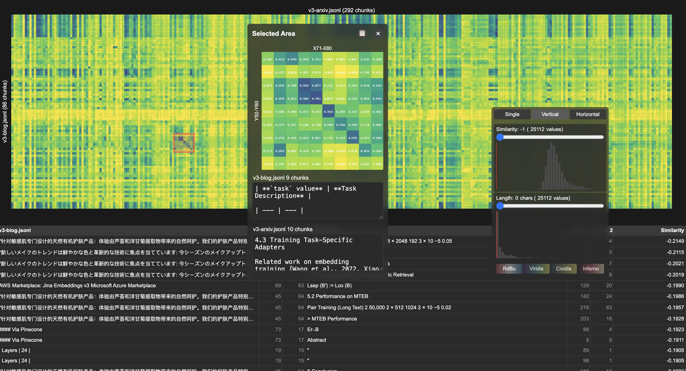

# Correlations

A simple UI for debugging correlations of text embeddings. At Jina AI we use this tool for vibe-checking embeddings, late chunking, etc.




## Get Started

```bash
npm install
export JINA_API_KEY=your_jina_key_here
npm run embed -- https://jina.ai/news/jina-embeddings-v3-a-frontier-multilingual-embedding-model -o v3-blog.jsonl -t retrieval.query
npm run embed -- https://arxiv.org/pdf/2409.10173 -o v3-arxiv.jsonl -t retrieval.passage
npm run corr -- v3-blog.jsonl v3-arxiv.jsonl
```

`JINA_API_KEY` is used for embedding and reading content from a URL when necessary. You can also [bring your own embeddings](#bring-your-own-embeddings) and just do `npm run corr ...` for visualization.

## UI Features

The correlation visualization is served on `http://localhost:3000` by default. Here's what you can do:

### Main View
- **Switch Layout**: Click buttons in top-right to toggle between single view, vertical split, or horizontal split
- **Hover Cells**: See full text and similarity score for any cell
- **Draw Selection**: Click and drag to select regions for analysis

### Control Panel
Always visible in top-right corner, or move the control panel anywhere on screen.
- **Adjust Thresholds**: Use sliders to filter by cosine similarity score (0-1) and text length
- **Change Colors**: Switch between RdBu, Viridis, Plasma, or Inferno color schemes

### Selection Panel
Draw a selection rectangle on the heatmap to open the panel.
- **Copy Text**: Copy selected content to clipboard
- **Close Panel**: Click X to dismiss selection

### Details Table
Click "Vertical" or "Horizontal" layout button to open this table.
- **Hover Rows**: See full text in tooltip
- **Scroll**: Browse through top 100 correlations

## CLI Reference

You can do either `npm run embed` or `npm run corr`. Note the double dash `--` is required for passing args, it tells npm that the following arguments should be passed to the script rather than being interpreted as npm options.

### `embed` Command

`npm run embed` uses Jina Embedding API, you can get a Jina API Key with free 10M tokens from https://jina.ai/#apiform. After that, make sure you do `export JINA_API_KEY=your_jina_key_here`.

| Argument | Description | Default |
|----------------|-------------|---------|
| `<input>` | Local text file path or URL | required |
| `-c, --chunk <type>` | Chunking type (newline, punctuation, characters, regex) | newline |
| `-v, --value <value>` | Value for chunking (number for characters, regex pattern) | - |
| `-d, --dimensions <number>` | Embedding dimensions | 1024 |
| `-l, --late-chunking` | Enable late chunking | false |
| `-t, --task-type <type>` | Task type (text-matching, retrieval.passage, retrieval.query) | - |
| `-o, --output <path>` | Output JSONL file path | auto-generated |

### `corr` Command

| Argument | Description | Default |
|----------------|-------------|---------|
| `<file1>` | First JSONL file with embeddings | required |
| `[file2]` | Second JSONL file with embeddings (optional) | - |
| `-p, --port <number>` | Port for visualization server | 3000 |

## Usage

### Basic Examples

```bash
# visit jina.ai to get a free key
export JINA_API_KEY=your_jina_key_here
```

1. Embed a text file with default settings (newline chunking):
```bash
npm run embed -- input.txt -o file1.jsonl
```

2. Embed content from a URL:
```bash
npm run embed -- https://example.com/article -o file2.jsonl
```
Behind the scene, it calls Jina Reader to crawl the content behind the given URL.

3. Visualize self-correlations within a single file:
```bash
npm run corr -- file1.jsonl
```

4. Visualize correlations between two files:
```bash
npm run corr -- file1.jsonl file2.jsonl
```

### Advanced Embedding Options

1. Use punctuation-based chunking:
```bash
npm run embed -- input.txt --chunk punctuation
```

2. Split by character count:
```bash
npm run embed -- input.txt --chunk characters --value 500
```

3. Use custom regex pattern for chunking:
```bash
npm run embed -- input.txt --chunk regex --value "\\n\\n"
```

4. Enable late chunking:
```bash
npm run embed -- input.txt --late-chunking
```

5. Specify task type for better embeddings:
```bash
npm run embed -- input.txt --task-type text-matching
npm run embed -- input.txt --task-type retrieval.passage
npm run embed -- input.txt --task-type retrieval.query
```

6. Custom output file:
```bash
npm run embed -- input.txt --output custom.jsonl
```

### Visualization Options

1. Change visualization server port:
```bash
npm run corr -- file1.jsonl --port 8080
```

2. Compare embeddings with different dimensions:
```bash
npm run embed -- input.txt --dimensions 512
npm run corr -- output.jsonl
```

## Bring Your Own Embeddings

To use `npm run corr`, your data must be in a JSONL file where each line is a JSON object with:
- `chunk`: The text segment (string)
- `embedding`: The embedding vector (array of numbers)

Example line:
```json
{"chunk": "This is a text segment.", "embedding": [0.123, -0.456, ...]}
```

If you bring your own embeddings:
1. Ensure your JSONL file follows the above format.
2. Each line must have both `chunk` and `embedding` fields.
3. Place your file where you want and reference it when running `npm run corr`.

No extra metadata is needed; embeddings must be precomputed and stored as arrays of numbers.
